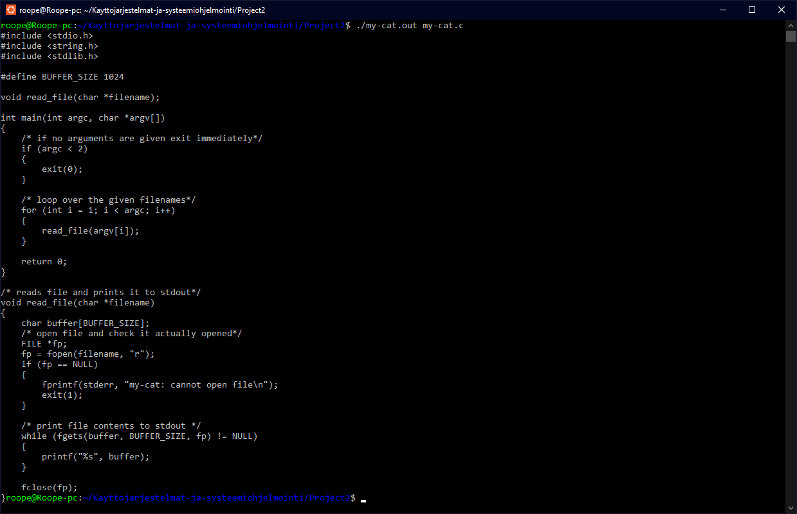

# Project 2 - Unix Utilities

## Project description:

Full description can be found [here.](https://github.com/remzi-arpacidusseau/ostep-projects/blob/master/initial-utilities/README.md) Only difference beign the naming scheme of the files, (wcat -> my-cat)

### TL;DR

Implementing the following UNIX commands:

* cat
* grep
* zip
* unzip

---

## How to run:

To run the project first compile the file of your choosing (my-cat.c, my-grep.c, my-zip.c or my-unzip.c) by running the command 

``make <name of command> (cat, grep, zip, unzip)``

or alternatively compile all of the files with 

``make all``

Then refer to the command specific documentation.

* [cat](https://github.com/Roope1/Kayttojarjestelmat-ja-systeemiohjelmointi/blob/main/Project2/README.md#my-cat.c)
* [grep](https://github.com/Roope1/Kayttojarjestelmat-ja-systeemiohjelmointi/blob/main/Project2/README.md#my-grep.c)
* [zip](https://github.com/Roope1/Kayttojarjestelmat-ja-systeemiohjelmointi/blob/main/Project2/README.md#my-zip.c)
* [unzip](https://github.com/Roope1/Kayttojarjestelmat-ja-systeemiohjelmointi/blob/main/Project2/README.md#my-unzip.c)

## my-cat.c

Command usage:
>> ./my-cat.out \<filename(s)>

A simple cat command that prints the contents of any give file into the console.

Above is my-cat command showing its own source code. by running it with ``./my-cat.out my-cat.c``

## my-grep.c

## my-zip.c

## my-unzip.c