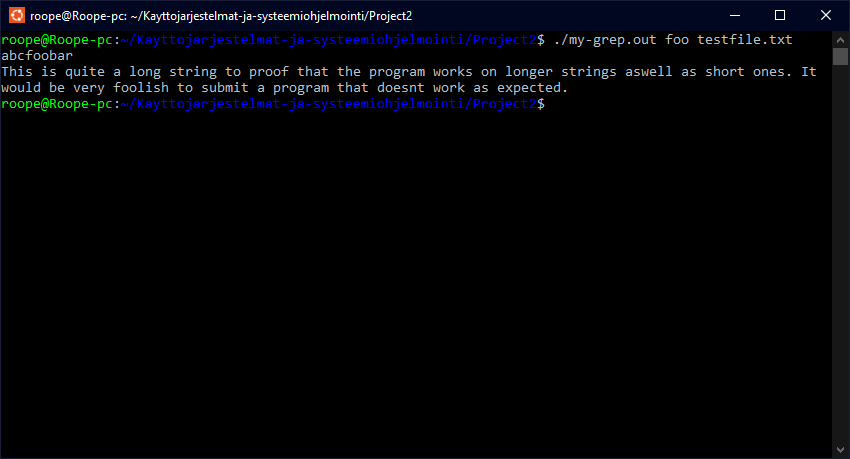

# Project 2 - Unix Utilities

## Project description:

Full description can be found [here.](https://github.com/remzi-arpacidusseau/ostep-projects/blob/master/initial-utilities/README.md) Only difference beign the naming scheme of the files, (wcat -> my-cat)

### TL;DR

Implementing the following UNIX commands:

* cat
* grep
* zip
* unzip

---

## How to run:

To run the project first compile the file of your choosing (my-cat.c, my-grep.c, my-zip.c or my-unzip.c) by running the command 

``make <name of command> (cat, grep, zip, unzip)``

or alternatively compile all of the files with 

``make all``

Then refer to the command specific documentation.

* [cat](#my-catc)
* [grep](#my-grepc)
* [zip](#my-zipc)
* [unzip](#my-unzipc)

---

## my-cat.c

### Command usage:

``./my-cat.out <filename(s)>``

A simple cat command that prints the contents of any give file into the console.


Above is my-cat command showing its own source code. by running it with ``./my-cat.out my-cat.c``

---

## my-grep.c

### Command usage:
``./my-grep.out <pattern> <filename(s)>``

Simplified grep command that takes a pattern and prints all the lines in the input file(s) that contain the pattern. If no input files are specified grep wil read from stdin.



Above is my grep command matching the pattern "foo" to the file "testfile.txt" that contains the following:

```
12345
abcfoobar
dog
cat
This is quite a long string to proof that the program works on longer strings aswell as short ones. It would be very foolish to submit a program that doesnt work as expected.
```

## my-zip.c

## my-unzip.c